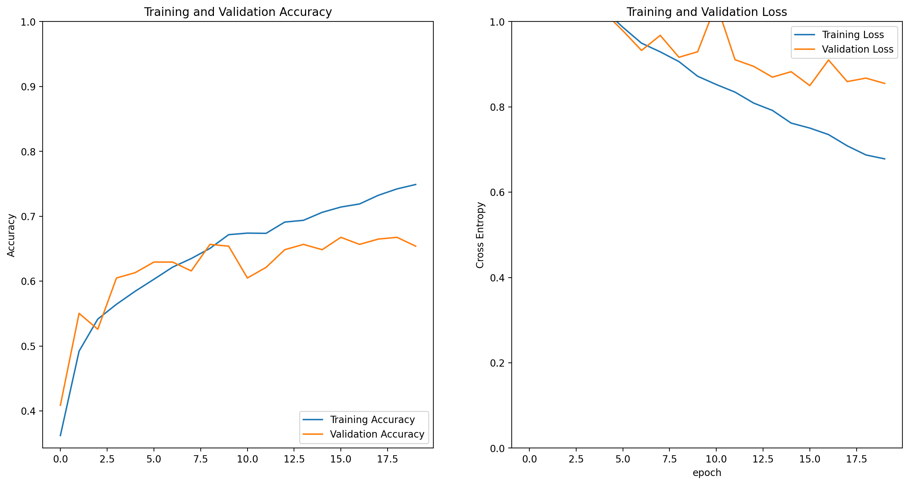
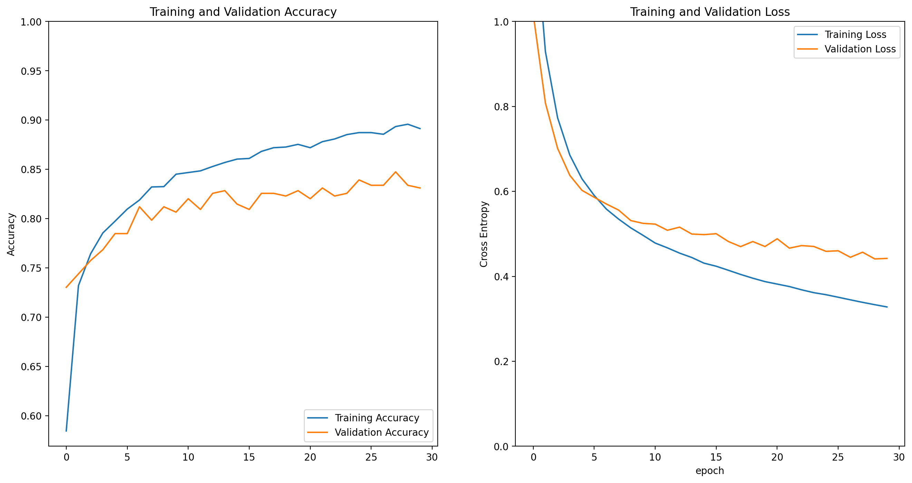
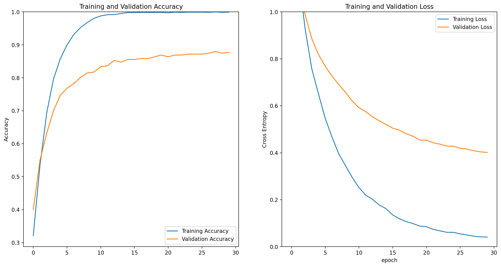
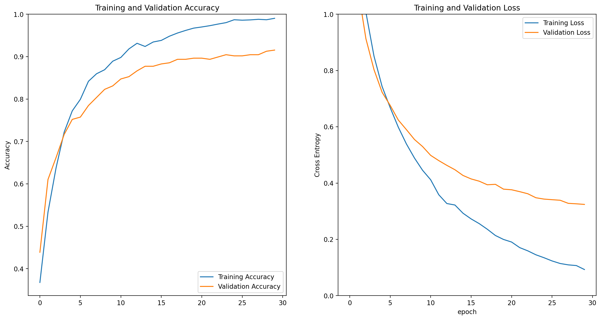

# README

- 작성자 : 이혁희

이번 프로젝트는 tensorflow_datasets의 tf_flower 데이터를 이용하여 꽃의 종류를 분류하는 실험을 하였습니다.
특히, Transfer Learning의 효용성을 알아 보았습니다.

# 실험한 모델들
이번 프로젝트에서 실험해 본 모델은 다음과 같습니다.
- 모델 1 : 기본 모델
- 모델 2 : VGG16을 이용한 Transfer Learning
- RestNet50 V2를 이용한 Transfer Learning
    - 모델 3.1 : RestNet50의 마지막 블록을 재학습
    - 모델 3.2 : RestNet50의 마지막 블록을 재학습 + data augmentation

| 모델  |  test_loss | test_accuracy | 비고 |
|------|------------|---------------|------|
|모델 1 | 0.7827 | 0.6948 |    
|모델 2 | 0.8474 | 0.4091 |
|모델 3.1| 0.3708  | 0.8801 |
|모델 3.2| 0.3177 | 0.9101 |모델 3.1에 비해 학습 그래프가 예쁘게 수렴함|

## [모델 1] 기본모델

- ### model summary
```
Model: "sequential_38"
_________________________________________________________________
 Layer (type)                Output Shape              Param #   
=================================================================
 conv2d_9 (Conv2D)           (None, 160, 160, 16)      448       
                                                                 
 max_pooling2d_42 (MaxPooli  (None, 80, 80, 16)        0         
 ng2D)                                                           
                                                                 
 conv2d_10 (Conv2D)          (None, 80, 80, 32)        4640      
                                                                 
 max_pooling2d_43 (MaxPooli  (None, 40, 40, 32)        0         
 ng2D)                                                           
                                                                 
 conv2d_11 (Conv2D)          (None, 40, 40, 64)        18496     
                                                                 
 max_pooling2d_44 (MaxPooli  (None, 20, 20, 64)        0         
 ng2D)                                                           
                                                                 
 flatten_3 (Flatten)         (None, 25600)             0         
                                                                 
 dense_43 (Dense)            (None, 512)               13107712  
                                                                 
 dense_44 (Dense)            (None, 5)                 2565      
                                                                 
=================================================================
Total params: 13133861 (50.10 MB)
Trainable params: 13133861 (50.10 MB)
Non-trainable params: 0 (0.00 Byte)
```
- ### loss/accuracy 그래프


## [모델 2] VGG16을 이용한 Transfer Learning

- ### model summary
```
Model: "sequential_31"
_________________________________________________________________
 Layer (type)                Output Shape              Param #   
=================================================================
 vgg16 (Functional)          (None, 5, 5, 512)         14714688  
                                                                 
 global_average_pooling2d_1  (None, 512)               0         
 0 (GlobalAveragePooling2D)                                      
                                                                 
 dense_35 (Dense)            (None, 1000)              513000    
                                                                 
 dense_36 (Dense)            (None, 5)                 5005      
                                                                 
=================================================================
Total params: 15232693 (58.11 MB)
Trainable params: 518005 (1.98 MB)
Non-trainable params: 14714688 (56.13 MB)
_________________________________________________________________
```
- ### loss/accuracy 그래프


## 3. RestNet50 V2를 이용한 Transfer Learning
- tf.keras.applications.resnet_v2.ResNet50V2
### [모델 3.1] RestNet50의 마지막 블록을 재학습
- conv4_block1, conv4_block2를 재학습함.
    ```python
    base_model.trainable = True

    for layer in base_model.layers[:86]:
        layer.trainable = False
    ```
- dense(32), batchnormal, dense(5) 레이어 추가
- ### model summary
```
[ResNet50 V2 Block]의 재학습 여부
0 input_13 False
1 conv1_pad False
2 conv1_conv False
3 pool1_pad False
4 pool1_pool False
5 conv2_block1_preact_bn False
6 conv2_block1_preact_relu False
7 conv2_block1_1_conv False
8 conv2_block1_1_bn False
9 conv2_block1_1_relu False
10 conv2_block1_2_pad False
11 conv2_block1_2_conv False
12 conv2_block1_2_bn False
13 conv2_block1_2_relu False
14 conv2_block1_0_conv False
15 conv2_block1_3_conv False
16 conv2_block1_out False
17 conv2_block2_preact_bn False
18 conv2_block2_preact_relu False
19 conv2_block2_1_conv False
20 conv2_block2_1_bn False
21 conv2_block2_1_relu False
22 conv2_block2_2_pad False
23 conv2_block2_2_conv False
24 conv2_block2_2_bn False
25 conv2_block2_2_relu False
26 conv2_block2_3_conv False
27 conv2_block2_out False
28 conv2_block3_preact_bn False
29 conv2_block3_preact_relu False
30 conv2_block3_1_conv False
31 conv2_block3_1_bn False
32 conv2_block3_1_relu False
33 conv2_block3_2_pad False
34 conv2_block3_2_conv False
35 conv2_block3_2_bn False
36 conv2_block3_2_relu False
37 max_pooling2d_36 False
38 conv2_block3_3_conv False
39 conv2_block3_out False
40 conv3_block1_preact_bn False
41 conv3_block1_preact_relu False
42 conv3_block1_1_conv False
43 conv3_block1_1_bn False
44 conv3_block1_1_relu False
45 conv3_block1_2_pad False
46 conv3_block1_2_conv False
47 conv3_block1_2_bn False
48 conv3_block1_2_relu False
49 conv3_block1_0_conv False
50 conv3_block1_3_conv False
51 conv3_block1_out False
52 conv3_block2_preact_bn False
53 conv3_block2_preact_relu False
54 conv3_block2_1_conv False
55 conv3_block2_1_bn False
56 conv3_block2_1_relu False
57 conv3_block2_2_pad False
58 conv3_block2_2_conv False
59 conv3_block2_2_bn False
60 conv3_block2_2_relu False
61 conv3_block2_3_conv False
62 conv3_block2_out False
63 conv3_block3_preact_bn False
64 conv3_block3_preact_relu False
65 conv3_block3_1_conv False
66 conv3_block3_1_bn False
67 conv3_block3_1_relu False
68 conv3_block3_2_pad False
69 conv3_block3_2_conv False
70 conv3_block3_2_bn False
71 conv3_block3_2_relu False
72 conv3_block3_3_conv False
73 conv3_block3_out False
74 conv3_block4_preact_bn False
75 conv3_block4_preact_relu False
76 conv3_block4_1_conv False
77 conv3_block4_1_bn False
78 conv3_block4_1_relu False
79 conv3_block4_2_pad False
80 conv3_block4_2_conv False
81 conv3_block4_2_bn False
82 conv3_block4_2_relu False
83 max_pooling2d_37 False
84 conv3_block4_3_conv False
85 conv3_block4_out False
86 conv4_block1_preact_bn True
87 conv4_block1_preact_relu True
88 conv4_block1_1_conv True
89 conv4_block1_1_bn True
90 conv4_block1_1_relu True
91 conv4_block1_2_pad True
92 conv4_block1_2_conv True
93 conv4_block1_2_bn True
94 conv4_block1_2_relu True
95 conv4_block1_0_conv True
96 conv4_block1_3_conv True
97 conv4_block1_out True
98 conv4_block2_preact_bn True
99 conv4_block2_preact_relu True
100 conv4_block2_1_conv True
101 conv4_block2_1_bn True
102 conv4_block2_1_relu True
103 conv4_block2_2_pad True
104 conv4_block2_2_conv True
105 conv4_block2_2_bn True
106 conv4_block2_2_relu True
107 conv4_block2_3_conv True
108 conv4_block2_out True
109 conv4_block3_preact_bn True
110 conv4_block3_preact_relu True
111 conv4_block3_1_conv True
112 conv4_block3_1_bn True
113 conv4_block3_1_relu True
114 conv4_block3_2_pad True
115 conv4_block3_2_conv True
116 conv4_block3_2_bn True
117 conv4_block3_2_relu True
118 conv4_block3_3_conv True
119 conv4_block3_out True
120 conv4_block4_preact_bn True
121 conv4_block4_preact_relu True
122 conv4_block4_1_conv True
123 conv4_block4_1_bn True
124 conv4_block4_1_relu True
125 conv4_block4_2_pad True
126 conv4_block4_2_conv True
127 conv4_block4_2_bn True
128 conv4_block4_2_relu True
129 conv4_block4_3_conv True
130 conv4_block4_out True
131 conv4_block5_preact_bn True
132 conv4_block5_preact_relu True
133 conv4_block5_1_conv True
134 conv4_block5_1_bn True
135 conv4_block5_1_relu True
136 conv4_block5_2_pad True
137 conv4_block5_2_conv True
138 conv4_block5_2_bn True
139 conv4_block5_2_relu True
140 conv4_block5_3_conv True
141 conv4_block5_out True
142 conv4_block6_preact_bn True
143 conv4_block6_preact_relu True
144 conv4_block6_1_conv True
145 conv4_block6_1_bn True
146 conv4_block6_1_relu True
147 conv4_block6_2_pad True
148 conv4_block6_2_conv True
149 conv4_block6_2_bn True
150 conv4_block6_2_relu True
151 max_pooling2d_38 True
152 conv4_block6_3_conv True
153 conv4_block6_out True
154 conv5_block1_preact_bn True
155 conv5_block1_preact_relu True
156 conv5_block1_1_conv True
157 conv5_block1_1_bn True
158 conv5_block1_1_relu True
159 conv5_block1_2_pad True
160 conv5_block1_2_conv True
161 conv5_block1_2_bn True
162 conv5_block1_2_relu True
163 conv5_block1_0_conv True
164 conv5_block1_3_conv True
165 conv5_block1_out True
166 conv5_block2_preact_bn True
167 conv5_block2_preact_relu True
168 conv5_block2_1_conv True
169 conv5_block2_1_bn True
170 conv5_block2_1_relu True
171 conv5_block2_2_pad True
172 conv5_block2_2_conv True
173 conv5_block2_2_bn True
174 conv5_block2_2_relu True
175 conv5_block2_3_conv True
176 conv5_block2_out True
177 conv5_block3_preact_bn True
178 conv5_block3_preact_relu True
179 conv5_block3_1_conv True
180 conv5_block3_1_bn True
181 conv5_block3_1_relu True
182 conv5_block3_2_pad True
183 conv5_block3_2_conv True
184 conv5_block3_2_bn True
185 conv5_block3_2_relu True
186 conv5_block3_3_conv True
187 conv5_block3_out True
188 post_bn True
189 post_relu True
Model: "sequential_34"
_________________________________________________________________
 Layer (type)                Output Shape              Param #   
=================================================================
 resnet50v2 (Functional)     (None, 5, 5, 2048)        23564800  
                                                                 
 global_average_pooling2d_1  (None, 2048)              0         
 1 (GlobalAveragePooling2D)                                      
                                                                 
 sequential_32 (Sequential)  (None, 32)                65568     
                                                                 
 batch_normalization_9 (Bat  (None, 32)                128       
 chNormalization)                                                
                                                                 
 sequential_33 (Sequential)  (None, 32)                1056      
                                                                 
 dense_39 (Dense)            (None, 5)                 165       
                                                                 
=================================================================
Total params: 23631717 (90.15 MB)
Trainable params: 22140197 (84.46 MB)
Non-trainable params: 1491520 (5.69 MB)
_________________________________________________________________
```
- ### loss/accuracy 그래프


## [모델 3.2] ResNet50 V2의 일부 재학습 + Data Augmentation
- Data Augmentation을 통하여 데이터를 늘인 후 결과를 비교해 보기로 함.
    - test accurary가 3%높아지고 test loss가 5% 정도 낮아짐.
    - validataion loss, accuracy가 더 안정적으로 예쁘게 수렴하는 모습을 보임.
    - data의 양이 많고 다양한 것이 중요하구나!!!
- Data Augmentaion
    - 좌우 반전, 상하 반전, brightness 조절(20%까지), contrast 조절(20%까지)
    - run_prep/augment_image함수

- ### model summary
    - [모델 3.1]과 같다.

- ### loss/accuracy 그래프


# 교훈
- 잘 학습된 좋은 모델을 기반으로 Transfer Learning을 하는 것이 성능을 높이는 좋은 방법이다.
    - 기본 모델 -> VGG16 -> ResNet50 V2 순서대로 테스트 성능이 좋았습니다.
    - 같은 ResNet50이라도 V1과 V2의 테스트 성능이 확연히 달랐습니다.(50%대 : 85%)
- 데이터의 퀄리티와 양이 중요하다.
    - 같은 ResNet50V2 기반으로 Transfer Learning을 하더라도 data augmentation을 했을 때 성능이 더 좋았습니다.
    - 더 중요한 것은 후자 쪽의 loss/accuracy가 수렴하는 모양이 더 좋았다는 것입니다.(천천히 꾸준히 수렴)
- learning rate가 중요하다.
    - learning rate를 0.001로 했을 때보다 0.0001로 했을 때 수렴이 더 안정적이었습니다.

## [참고] run_prep.py
- 데이터 load/가공 등의 process와 성능 확인을 위한 함수 등을 모아 놓은 python 코드
- 실행 방법
    - ```%run run_prep.py [data_aumentation_flag]```
    - data_augmentation_flag : data augmentation을 할지 여부
- agument_image
    - 원본 이미지에서  좌우 회전, 상하 회전, brightness, contrast 등을 조절한 이미지를 생성한다.
    - 1장의 이미지로 4장의 이미지 추가 생성

# 회고
## 잘한 점
- 동료 그루들과 아이디어를 공유하면서 모델의 성능을 향상 시켰습니다.
- Transfer Learning의 효용성을 알았습니다.
- 모델 복잡도에 따른 데이터 양과 다양성의 중요성과 data augmentation의 효용성을 알았습니다.
## 문제점
- 실험을 반복할 때 모델/파라미터/데이터의 변경 내용과 실험 결과를 기록하고 추적하는 것이 매우 어려웠습니다.
## 배운 점
- 모델학습은 시행착오가 많아서 혼자 하면 늪에 빠지기 쉽고 동료 그루들과 아이디어와 결과를 공유하면서 공부해야 발전이 빠르다는 것을 알았습니다.