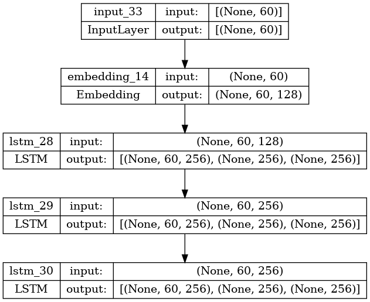

# README

- 작성자 : 이혁희

이번 프로젝트는 어텐션 메커니즘을 이용한 뉴스 요약봇 만들기 입니다.
실행화일은 '4. 프로젝트: 뉴스기사 요약해보기.ipynb'입니다.

## 2. 데이터 전처리(추상적 요약)
### 2-1 데이터 전처리
- html 태그 제거
- ()로 닫힌 문자열 제거
- " 제거
- 약어 정규화
- 소유격 제거
- 영어 외 문자(숫자, 특수문자 등) 공백으로 변환
- m이 3개 이상 -> 2개로 변경
- 불용어 제거(remove_stopwords = True이면)

### 2-2 데이터 인코딩과 데이터 정리
- encoder_input
    - text_max_len = 60
    - src_vocab = 22000(등장 빈도 7회 이하인 단어 제외)
- decoder_input
    - headlines_max_len = 12
    - tar_vocab = 11000(등장 빈도 5회 이하인 단어 제외)
- train/test 데이터 수 : 76670/19167

## 3. Attention을 활용한 seq2seq 모델 설계 및 학습

### 3.1 훈련 모델 요약
```
Model: "model_25"
__________________________________________________________________________________________________
 Layer (type)                Output Shape                 Param #   Connected to                  
==================================================================================================
 input_33 (InputLayer)       [(None, 60)]                 0         []                            
                                                                                                  
 embedding_14 (Embedding)    (None, 60, 128)              2816000   ['input_33[0][0]']            
                                                                                                  
 lstm_28 (LSTM)              [(None, 60, 256),            394240    ['embedding_14[0][0]']        
                              (None, 256),                                                        
                              (None, 256)]                                                        
                                                                                                  
 input_34 (InputLayer)       [(None, None)]               0         []                            
                                                                                                  
 lstm_29 (LSTM)              [(None, 60, 256),            525312    ['lstm_28[0][0]']             
                              (None, 256),                                                        
                              (None, 256)]                                                        
                                                                                                  
 embedding_15 (Embedding)    (None, None, 128)            1408000   ['input_34[0][0]']            
                                                                                                  
 lstm_30 (LSTM)              [(None, 60, 256),            525312    ['lstm_29[0][0]']             
                              (None, 256),                                                        
                              (None, 256)]                                                        
                                                                                                  
 lstm_31 (LSTM)              [(None, None, 256),          394240    ['embedding_15[0][0]',        
                              (None, 256),                           'lstm_30[0][1]',             
                              (None, 256)]                           'lstm_30[0][2]']             
                                                                                                  
 attention_layer (AdditiveA  (None, None, 256)            256       ['lstm_31[0][0]',             
 ttention)                                                           'lstm_30[0][0]']             
                                                                                                  
 concat_layer (Concatenate)  (None, None, 512)            0         ['lstm_31[0][0]',             
                                                                     'attention_layer[0][0]']     
                                                                                                  
 dense_13 (Dense)            (None, None, 11000)          5643000   ['concat_layer[0][0]']        
                                                                                                  
==================================================================================================
Total params: 11706360 (44.66 MB)
Trainable params: 11706360 (44.66 MB)
Non-trainable params: 0 (0.00 Byte)

```


### 3.2 모델 훈련

- tar_vocab = 11000일 때 loss 그래프


- tar_vacab 별 최종 loss
    | tar_vocab | loss | val_loss |
    |-----------|------|----------|
    | 10000     | 2.91 | 3.81     |
    |  5000     | 2.55 | 3.33     |
    |  2000     | 2.06 | 2.59     |
    |  1000     | 1.65 | 2.05     |
    |   500     | 1.29 | 1.56     |
- tar_vocab  사이즈를 줄일 수록 val_loss가 줄어 들어서 계속 실험해 보았습니다.
    - 그런데 예측 요약이 점점 이상해졌습니다.(너무 일반적인 요약)
    > tar_vocab = 500일 때 요약예
    >    ```
    >    실제 요약 : no sexual with son 
    >    예측 요약 :  no one of on
    >
    >    실제 요약 : french hit with in face for time 
    >    예측 요약 :  video shows in
    >
    >    실제 요약 : must take on tesla 
    >    예측 요약 :  tesla on tesla
    >
    >    실제 요약 : cong leader fb 2019 to cong 
    >    예측 요약 :  fb to in polls
    >    ```
- label의 숫자가 적을 수록 loss가 줄어드는 경향이 있으므로 loss만 보고 최적화하면 안되는 것을 알았습니다.
    
### 3.3 predicion 모델
#### 인코더 모델


#### 디코더 모델


## Step 4. 실제 결과와 요약문 비교하기(추상적 요약)
다음은 원문, 실제 요약, 예측 요약을 5개만 보여 줍니다. 요약 성능이 그다지 좋지 않습니다. 의미상 실제 요약과 비슷하지 않은 경우가 많고 같은 단어를 반복적으로 출력하는 경우도 많습니다.

tar_vocab을 500까지 줄여서 실험해 보았는데, loss는 더 적게 나오지만 예측 요약이 너무 축약되어서 의미를 알아 보기 힘든 경우가 많았습니다.
```
원문 : ministers are taking leadership lessons at the indian institute of management ahmedabad to deliver on their pre poll promises the ministers who were on a three day study tour that started on monday have taken lessons on leadership and ethics healthcare education and public private partnership the bjp government came to power in jharkhand two and a half years ago 
실제 요약 : jharkhand ministers take management lessons at iim a 
예측 요약 :  punjab govt to get special for 3 days in parliament


원문 : irish tech startup has rolled out a plan to produce a imaging system that can identify cows from their facial features and hide patterns the artificial intelligence ai system will use face recognition to track the behaviour eating patterns and overall health of livestock it will then send instant alerts to farmers helping them take on farm decisions nnnn 
실제 요약 : irish startup to develop facial recognition system for cows 
예측 요약 :  startup bans meat recognition to monitor people in us


원문 : speaking during the lok sabha debate over the rafale deal defence minister nirmala sitharaman has said there is a difference between defence dealings and dealing in defence we deal in defence with national security as a priority congress failed to bring even a single aircraft during upa's tenure all 36 fighter jets will come to india by 2022 sitharaman added 
실제 요약 : difference in defence and dealing in defence sitharaman 
예측 요약 :  rafale deal with rafale deal with sitharaman


원문 : samajwadi party founder mulayam singh yadav has slammed his son akhilesh yadav stating one who his father can't be a friend of others no father made his son the cm during his own lifetime and what did akhilesh do he sacked his own uncle from his cabinet mulayam said i've never been insulted so much he added 
실제 요약 : one who his father canã¢â€â™t be others' friend mulayam 
예측 요약 :  shivpal yadav calls me for son tej pratap


원문 : pakistani cricketer turned politician imran khan tied the knot for the third time on sunday khan's wife is a also known as the 65 year old first married in 1995 to daughter of a british billionaire before separating in 2004 he later married tv anchor reham khan in 2015 but parted ways 10 months later 
실제 요약 : former pak captain imran khan ties the knot for third time 
예측 요약 :  imran khan attends wife wife in his son
```

## Step 5. Summa를 이용해서 추출적 요약해 보기
text column의 text를 다음과 같이 요약하고 그 결과를 각각 summary_1, summary_2에 저장하였습니다.

```
summarize(x, ratio = 0.4)
summarize(x, words = 15)
```

그 중 10개를 출력해 보면 다음과 같습니다.
비어 있는 칸은 추출적 요약이 문장을 추출하는데 text에 저장된 문장의 길이가 기준을 넘어서 출력이 되지 않은 것 같습니다.

```
	summary_1	summary_2
1	Users get one CRED coin per rupee of bill paid...	Users get one CRED coin per rupee of bill paid...
2	The match witnessed India getting all out for ...	The match witnessed India getting all out for ...
3	Also, customers have options to insure against...	Also, customers have options to insure against...
5	Pakistani singer Rahat Fateh Ali Khan has deni...	Pakistani singer Rahat Fateh Ali Khan has deni...
7		
8	Andhra Pradesh CM N Chandrababu Naidu has said...
9	Congress candidate Shafia Zubair won the Ramga...	Congress candidate Shafia Zubair won the Ramga...
10		
```

## 회고
### 잘한 점
- Attention 모델을 사용한 seq2seq 모델을 설계하고 학습해 보았다.

### 문제점
- 예측 요약이 실제 요약과 의미상 다른 경우가 많았고 문장이 이상한 경우도 많았다.

### 배운 점
- 언어 모델을 학습하기 위하여는 전처리 과정이 복잡함을 알았고 그런 과정을 거쳐야 학습이 된다는 것을 알았다. 
- Attention 모델과 seq2seq 모델을 배웠다.
