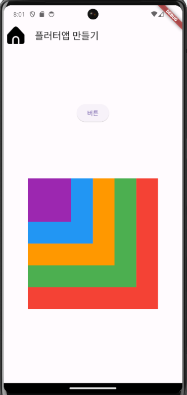
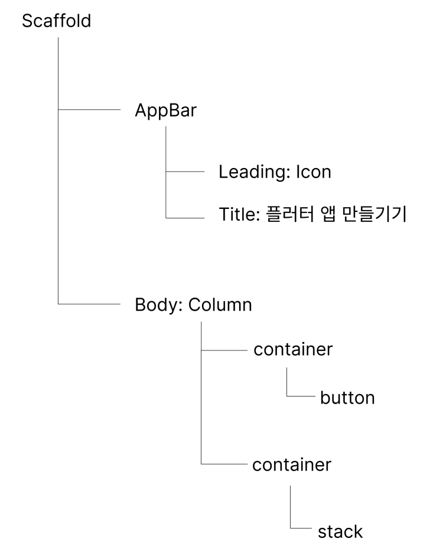

# README

- 이번 과제에서는 다음과 같이 플러터앱 화면을 구성하고 출력하였습니다.

- Widget Tree를 다음과 같이 구성하였습니다.(코딩하는 과정에서 Button 

Widget위에 Align Widget 추가)

- 화면 구성 코드
    - lib/main.dart

## 회고
### 잘한 점
- 과제가 요구하는 앱화면을 구성하여 출력했다.
### 문제점
### 배운 점
- 화면을 어떻게 구성할지 Widget Tree를 먼저 그려 보니 코딩하는 과정이 더 쉬웠습니다.
